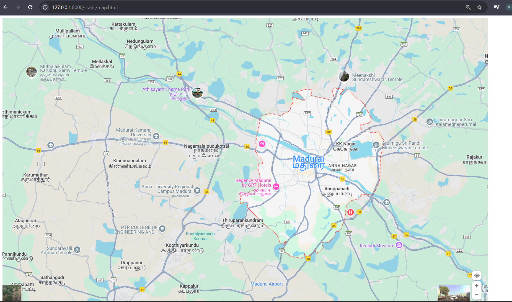
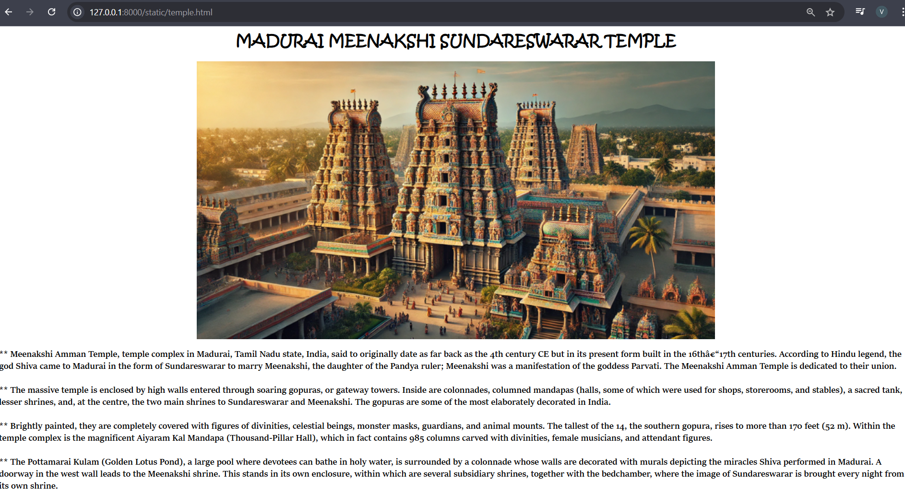
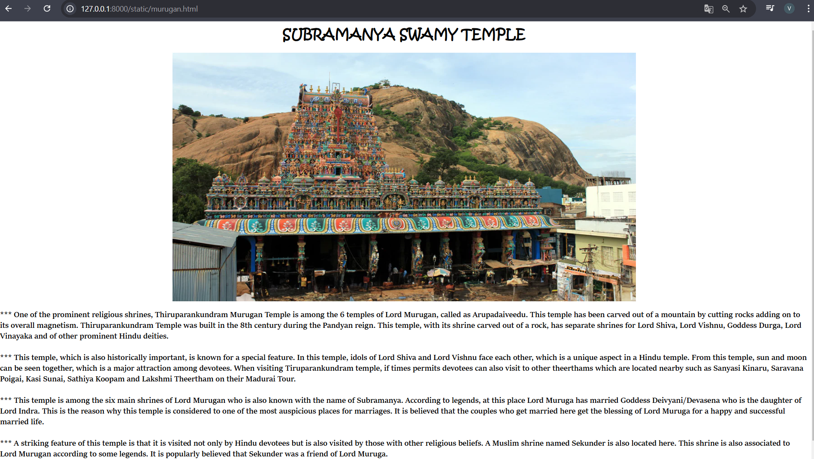
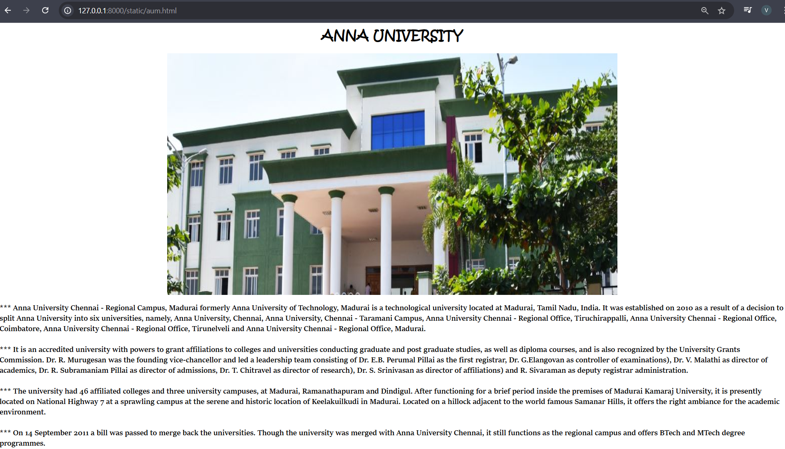
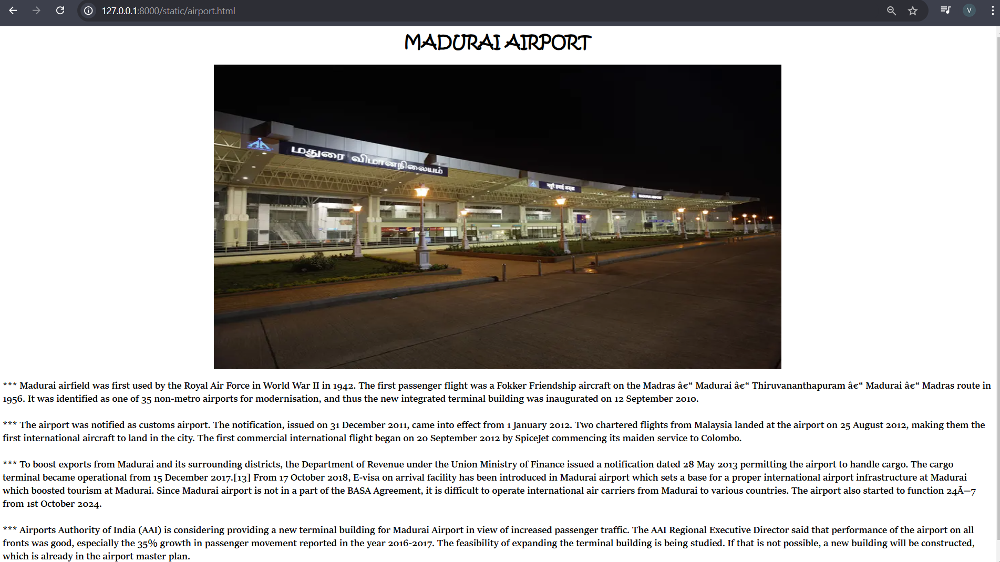
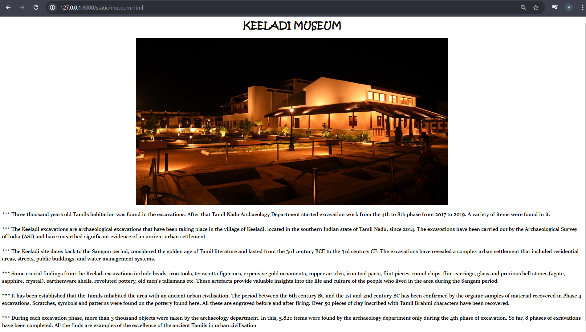
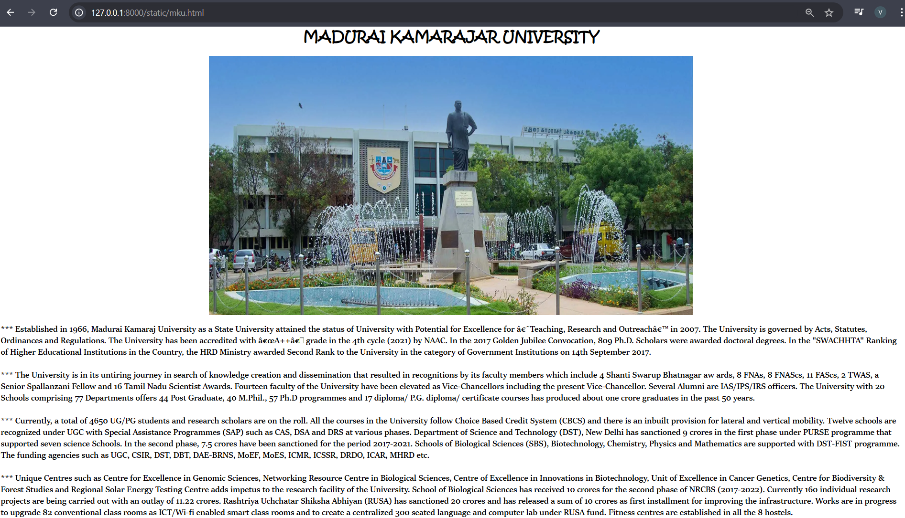

# Ex04 Places Around Me
## Date: 10/12/2024

## AIM
To develop a website to display details about the places around my house.

## DESIGN STEPS

### STEP 1
Create a Django admin interface.

### STEP 2
Download your city map from Google.

### STEP 3
Using ```<map>``` tag name the map.

### STEP 4
Create clickable regions in the image using ```<area>``` tag.

### STEP 5
Write HTML programs for all the regions identified.

### STEP 6
Execute the programs and publish them.

## CODE
```
<html>
    <head>
        <style>
            body {
              
              background-repeat: no-repeat;
              background-attachment: fixed;
              background-size: cover;
            }
            </style>s
    </head>
    <body> 
        <map name="image-map">    
         <area shape="circle" coords="1318,230,72" title="MEENAKSHI SUNDARESHWARAR TEMPLE"  alt="temple"  href="temple.html"  >

         <area shape="circle" coords="589,448,52"  title="KAMARAJAR UNIVERSITY" alt="university"  href="mku.html"  >

         <area shape="circle" coords="1531,879,59" title="KEELADI MUSEUM" alt="museum" href="museum.html"  >

         <area shape="circle" coords="1026,1014,71" title="AIRPORT" alt="airport" href="airport.html"  >

         <area shape="circle" coords="927,788,68" title="MURUGAN TEMPLE" alt="murugan"  href="murugan.html" >

         <area shape="circle" coords="737,659,65" title="ANNA UNIVERSITY" alt="anna"  href="aum.html"  >

        </map>
         

    </body>
</html>
```
temple.html
```
<html>
    <head>

    </head>
    <body>
        <center ><h1 style="font-family: Kristen ITC;"><b>MADURAI MEENAKSHI SUNDARESWARAR TEMPLE</b></h1></center>
        <center></center>
        <p style="font-size: 20px; font-family:'Sitka Display Semibold'; text-align: left;">
             **  Meenakshi Amman Temple, temple complex in Madurai, Tamil Nadu state, India, said to originally date as far back as the 4th century CE but in its present form built in the 16th–17th centuries.
               According to Hindu legend, the god Shiva came to Madurai in the form of Sundareswarar to marry Meenakshi, the daughter of the Pandya ruler; Meenakshi was a manifestation of the goddess Parvati.
               The Meenakshi Amman Temple is dedicated to their union. <br><br>
            **   The massive temple is enclosed by high walls entered through soaring gopuras, or gateway towers.
               Inside are colonnades, columned mandapas (halls, some of which were used for shops, storerooms, and stables), a sacred tank, lesser shrines, and, at the centre, the two main shrines to Sundareswarar and Meenakshi. 
               The gopuras are some of the most elaborately decorated in India. <br><br>
             **  Brightly painted, they are completely covered with figures of divinities, celestial beings, monster masks, guardians, and animal mounts. The tallest of the 14, the southern gopura, rises to more than 170 feet (52 m).
               Within the temple complex is the magnificent Aiyaram Kal Mandapa (Thousand-Pillar Hall), which in fact contains 985 columns carved with divinities, female musicians, and attendant figures.<br><br>
             **  The Pottamarai Kulam (Golden Lotus Pond), a large pool where devotees can bathe in holy water, is surrounded by a colonnade whose walls are decorated with murals depicting the miracles Shiva performed in Madurai.
               A doorway in the west wall leads to the Meenakshi shrine. This stands in its own enclosure, within which are several subsidiary shrines, together with the bedchamber, where the image of Sundareswarar is brought every night from its own shrine.<br><br>
        </p>
        
    </body>
</html>
```
mku.html
```
<html>
    <head>

    </head>
    <body>
        <center ><h1 style="font-family: Kristen ITC;"><b>MADURAI KAMARAJAR UNIVERSITY</b></h1></center>
        <center></center>
        <p style="font-size: 20px; font-family:'Sitka Display Semibold'; text-align: left;">
            *** Established in 1966, Madurai Kamaraj University as a State University attained the status of University with Potential for Excellence for ‘Teaching, Research and Outreach’ in 2007. 
            The University is governed by Acts, Statutes, Ordinances and Regulations. 
            The University has been accredited with “A++” grade in the 4th cycle (2021) by NAAC.
            In the 2017 Golden Jubilee Convocation, 809 Ph.D. Scholars were awarded doctoral degrees.
            In the "SWACHHTA" Ranking of Higher Educational Institutions in the Country, the HRD Ministry awarded Second Rank to the University in the category of Government Institutions on 14th September 2017.<br><br>

            *** The University is in its untiring journey in search of knowledge creation and dissemination that resulted in recognitions by its faculty members which include 4 Shanti Swarup Bhatnagar aw ards, 8 FNAs, 8 FNAScs, 11 FAScs, 2 TWAS, a Senior Spallanzani Fellow and 16 Tamil Nadu Scientist Awards.
            Fourteen faculty of the University have been elevated as Vice-Chancellors including the present Vice-Chancellor.
            Several Alumni are IAS/IPS/IRS officers.
            The University with 20 Schools comprising 77 Departments offers 44 Post Graduate, 40 M.Phil., 57 Ph.D programmes and 17 diploma/ P.G. diploma/ certificate courses has produced about one crore graduates in the past 50 years.<br><br>

            *** Currently, a total of 4650 UG/PG students and research scholars are on the roll. All the courses in the University follow Choice Based Credit System (CBCS) and there is an inbuilt provision for lateral and vertical mobility.
            Twelve schools are recognized under UGC with Special Assistance Programmes (SAP) such as CAS, DSA and DRS at various phases. Department of Science and Technology (DST), New Delhi has sanctioned 9 crores in the first phase under PURSE programme that supported seven science Schools. 
            In the second phase, 7.5 crores have been sanctioned for the period 2017-2021. Schools of Biological Sciences (SBS), Biotechnology, Chemistry, Physics and Mathematics are supported with DST-FIST programme. The funding agencies such as UGC, CSIR, DST, DBT, DAE-BRNS, MoEF, MoES, ICMR, ICSSR, DRDO, ICAR, MHRD etc.<br><br>
   
            *** Unique Centres such as Centre for Excellence in Genomic Sciences, Networking Resource Centre in Biological Sciences, Centre of Excellence in Innovations in Biotechnology, Unit of Excellence in Cancer Genetics, Centre for Biodiversity & Forest Studies and Regional Solar Energy Testing Centre adds impetus to the research facility of the University.
            School of Biological Sciences has received 10 crores for the second phase of NRCBS (2017-2022). Currently 160 individual research projects are being carried out with an outlay of 11.22 crores. Rashtriya Uchchatar Shiksha Abhiyan (RUSA) has sanctioned 20 crores and has released a sum of 10 crores as first installment for improving the infrastructure.
            Works are in progress to upgrade 82 conventional class rooms as ICT/Wi-fi enabled smart class rooms and to create a centralized 300 seated language and computer lab under RUSA fund. Fitness centres are established in all the 8 hostels.<br><br>
            
        </p>
        
    </body>
</html>
```
museum.html
```
<html>
    <head>

    </head>
    <body>
        <center ><h1 style="font-family: Kristen ITC;"><b>KEELADI MUSEUM</b></h1></center>
        <center></center>
        <p style="font-size: 20px; font-family:'Sitka Display Semibold'; text-align: left;">
            *** Three thousand years old Tamils habitation was found in the excavations.
            After that Tamil Nadu Archaeology Department started excavation work from the 4th to 8th phase from 2017 to 2019. 
            A variety of items were found in it.<br><br>

            *** The Keeladi excavations are archaeological excavations that have been taking place in the village of Keeladi, located in the southern Indian state of Tamil Nadu, since 2014. 
            The excavations have been carried out by the Archaeological Survey of India (ASI) and have unearthed significant evidence of an ancient urban settlement.<br><br>

            *** The Keeladi site dates back to the Sangam period, considered the golden age of Tamil literature and lasted from the 3rd century BCE to the 3rd century CE. 
            The excavations have revealed a complex urban settlement that included residential areas, streets, public buildings, and water management systems.<br><br>

            *** Some crucial findings from the Keeladi excavations include beads, iron tools, terracotta figurines, expensive gold ornaments, copper articles, iron tool parts, flint pieces, round chips, flint earrings,
             glass and precious bell stones (agate, sapphire, crystal), earthenware shells, revoluted pottery, old men's talismans etc. 
            These artefacts provide valuable insights into the life and culture of the people who lived in the area during the Sangam period. <br><br>

            *** It has been established that the Tamils inhabited the area with an ancient urban civilisation. 
            The period between the 6th century BC and the 1st and 2nd century BC has been confirmed by the organic samples of material recovered in Phase 4 excavations.
            Scratches, symbols and patterns were found on the pottery found here. All these are engraved before and after firing. 
            Over 50 pieces of clay inscribed with Tamil Brahmi characters have been recovered.<br><br>

            *** During each excavation phase, more than 3 thousand objects were taken by the archaeology department. 
            In this, 5,820 items were found by the archaeology department only during the 4th phase of excavation. So far, 8 phases of excavations have been completed. 
            All the finds are examples of the excellence of the ancient Tamils in urban civilisation<br><br>
        </p>
        
    </body>
</html>
```
airport.html
```
<html>
    <head>

    </head>
    <body>
        <center ><h1 style="font-family: Kristen ITC;"><b>MADURAI AIRPORT</b></h1></center>
        <center></center>
        <p style="font-size: 20px; font-family:'Sitka Display Semibold'; text-align: left;">
            *** Madurai airfield was first used by the Royal Air Force in World War II in 1942. 
            The first passenger flight was a Fokker Friendship aircraft on the Madras – Madurai – Thiruvananthapuram – Madurai – Madras route in 1956.
            It was identified as one of 35 non-metro airports for modernisation, and thus the new integrated terminal building was inaugurated on 12 September 2010.<br><br>
            
            *** The airport was notified as customs airport. The notification, issued on 31 December 2011, came into effect from 1 January 2012. 
            Two chartered flights from Malaysia landed at the airport on 25 August 2012, making them the first international aircraft to land in the city. 
            The first commercial international flight began on 20 September 2012 by SpiceJet commencing its maiden service to Colombo.<br><br>
            
            *** To boost exports from Madurai and its surrounding districts, the Department of Revenue under the Union Ministry of Finance issued a notification dated 28 May 2013 permitting the airport to handle cargo. 
            The cargo terminal became operational from 15 December 2017.[13] From 17 October 2018, E-visa on arrival facility has been introduced in Madurai airport which sets a base for a proper international airport infrastructure at Madurai which boosted tourism at Madurai. 
            Since Madurai airport is not in a part of the BASA Agreement, it is difficult to operate international air carriers from Madurai to various countries. 
            The airport also started to function 24×7 from 1st October 2024.<br><br>

            *** Airports Authority of India (AAI) is considering providing a new terminal building for Madurai Airport in view of increased passenger traffic.
            The AAI Regional Executive Director said that performance of the airport on all fronts was good, especially the 35% growth in passenger movement reported in the year 2016-2017. 
            The feasibility of expanding the terminal building is being studied. If that is not possible, a new building will be constructed, which is already in the airport master plan.<br><br>
        </p>
        
    </body>
</html>
```
murugan.html
```
<html>
    <head>

    </head>
    <body>
        <center ><h1 style="font-family: Kristen ITC;"><b>SUBRAMANYA SWAMY TEMPLE</b></h1></center>
        <center></center>
        <p style="font-size: 20px; font-family:'Sitka Display Semibold'; text-align: left;">
            *** One of the prominent religious shrines, Thiruparankundram Murugan Temple is among the 6 temples of Lord Murugan, called as Arupadaiveedu. 
            This temple has been carved out of a mountain by cutting rocks adding on to its overall magnetism.
            Thiruparankundram Temple was built in the 8th century during the Pandyan reign.
            This temple, with its shrine carved out of a rock, has separate shrines for Lord Shiva, Lord Vishnu, Goddess Durga, Lord Vinayaka and of other prominent Hindu deities.  <br><br>
         
            *** This temple, which is also historically important, is known for a special feature. In this temple, idols of Lord Shiva and Lord Vishnu face each other, which is a unique aspect in a Hindu temple. 
            From this temple, sun and moon can be seen together, which is a major attraction among devotees.
            When visiting Tiruparankundram temple, if times permits devotees can also visit to other theerthams which are located nearby such as Sanyasi Kinaru, Saravana Poigai, Kasi Sunai, Sathiya Koopam and
             Lakshmi Theertham on their Madurai Tour.<br><br>

            *** This temple is among the six main shrines of Lord Murugan who is also known with the name of Subramanya. 
            According to legends, at this place Lord Muruga has married Goddess Deivyani/Devasena who is the daughter of Lord Indra. 
            This is the reason why this temple is considered to one of the most auspicious places for marriages. 
            It is believed that the couples who get married here get the blessing of Lord Muruga for a happy and successful married life.<br><br>

            *** A striking feature of this temple is that it is visited not only by Hindu devotees but is also visited by those with other religious beliefs. 
            A Muslim shrine named Sekunder is also located here. This shrine is also associated to Lord Murugan according to some legends. 
            It is popularly believed that Sekunder was a friend of Lord Muruga.<br><br>
        </p>
        
    </body>
</html>
```
aum.html
```
<html>
    <head>

    </head>
    <body>
        <center ><h1 style="font-family: Kristen ITC;"><b>ANNA UNIVERSITY</b></h1></center>
        <center></center>
        <p style="font-size: 20px; font-family:'Sitka Display Semibold'; text-align: left;">
            *** Anna University Chennai - Regional Campus, Madurai formerly Anna University of Technology, Madurai is a technological university located at Madurai, Tamil Nadu, India. 
            It was established on 2010 as a result of a decision to split Anna University into six universities, namely, Anna University, Chennai, Anna University, Chennai - Taramani Campus, Anna University Chennai - Regional Office, Tiruchirappalli,
             Anna University Chennai - Regional Office, Coimbatore, Anna University Chennai - Regional Office, Tirunelveli and Anna University Chennai - Regional Office, Madurai.<br><br>
           
            *** It is an accredited university with powers to grant affiliations to colleges and universities conducting graduate and post graduate studies, as well as diploma courses, and is also recognized by the University Grants Commission.
            Dr. R. Murugesan was the founding vice-chancellor and led a leadership team consisting of Dr. E.B. Perumal Pillai as the first registrar, Dr. G.Elangovan as controller of examinations), Dr. V. Malathi as director of academics, 
            Dr. R. Subramaniam Pillai as director of admissions, Dr. T. Chitravel as director of research), Dr. S. Srinivasan as director of affiliations) and R. Sivaraman as deputy registrar administration.<br><br>
            
            *** The university had 46 affiliated colleges and three university campuses, at Madurai, Ramanathapuram and Dindigul.
            After functioning for a brief period inside the premises of Madurai Kamaraj University, it is presently located on National Highway 7 at a sprawling campus at the serene and historic location of Keelakuilkudi in Madurai. 
            Located on a hillock adjacent to the world famous Samanar Hills, it offers the right ambiance for the academic environment.<br><br>
            
            *** On 14 September 2011 a bill was passed to merge back the universities. Though the university was merged with Anna University Chennai, it still functions as the regional campus and offers BTech and MTech degree programmes.<br><br>
        </p>
        
    </body>
</html>
```

## OUTPUT









## RESULT
The program for implementing image maps using HTML is executed successfully.
